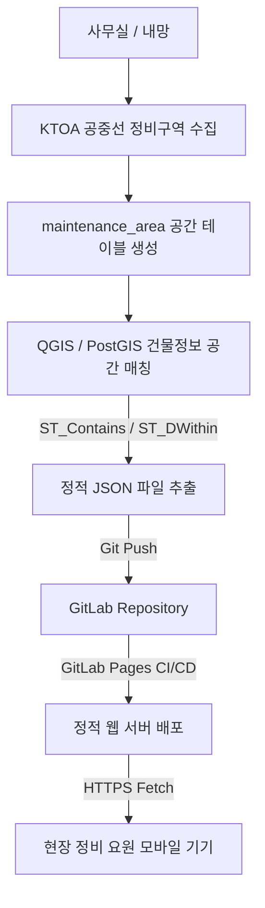

# SKB 공중선 정비관리 GIS 시스템

본 프로젝트는 현장 정비 요원들이 모바일을 통해 정비 구역과 가입자 건물 속성 정보를 손쉽게 조회할 수 있도록 설계된 **모바일 최적화 경량 GIS 시스템**입니다. 사내망 제한으로 현장에서 QGIS나 PostGIS 데이터베이스에 직접 접근할 수 없는 한계를 해결하기 위해, 사무실에서 사전에 가공한 공간 정보(JSON/GeoJSON)를 정적 웹 서비스로 제공합니다.

---

## 1. 프로젝트 폴더 구조

정적 웹 서비스로 GitLab Pages 환경에 즉시 배포될 수 있도록 모든 리소스를 `public` 폴더 하위에 배치하며, 기능별로 스크립트를 모듈화하였습니다.

```text
jyj2134528/aerial (Repository Root)
├── .gitlab-ci.yml                 # GitLab CI/CD Pages 배포 파이프라인 설정
├── README.md                      # 프로젝트 명세 및 개발 가이드
└── public/                        # 배포 대상 정적 웹 리소스 폴더
    ├── index.html                 # 메인 레이아웃 및 HTML 구조
    ├── css/
    │   └── style.css              # SKB 아이덴티티가 반영된 프리미엄 반응형 스타일시트
    ├── js/
    │   ├── app.js                 # 전체 컴포넌트 초기화 및 이벤트 오케스트레이션
    │   ├── data.js                # JSON 데이터 로드, 파싱 및 전역 상태 관리
    │   ├── map.js                 # Leaflet 지도 인스턴스 제어 및 GIS 레이어 렌더링
    │   ├── ui.js                  # 사이드바 리스트, 통계 카드, 이벤트 UI 핸들링
    │   └── utils.js               # 숫자 포맷터 및 공통 헬퍼 함수
    ├── assets/
    │   ├── images/                # 미디어 및 데모 이미지 리소스
    │   └── icons/                 # 지도 핀 및 앱 아이콘
    └── data/
        ├── areas.json             # 정비구역 목록 메타데이터
        └── areas/                 # 구역별 상세 데이터 폴더
            └── 2026-서울특별시-강남구-강남-1.json  # 개별 구역 GeoJSON 및 건물 속성 정보
```

---

## 2. 데이터 흐름 및 JSON 생성 규칙

### 데이터 흐름 아키텍처


### JSON 데이터 구조

#### 1) 구역 목록 (`public/data/areas.json`)
정비 구역 리스트와 각 구역별 중심점(Center), 데이터 파일 경로를 관리합니다.
```json
[
    {
        "area_id": "2026-seoul-gangnam-1",
        "area_name": "2026-서울특별시-강남구-강남-1",
        "file": "data/areas/2026-서울특별시-강남구-강남-1.json",
        "center": [37.4979, 127.0276]
    }
]
```

#### 2) 구역별 상세 데이터 (`public/data/areas/[filename].json`)
해당 구역의 폴리곤 정보(GeoJSON)와 구역 내/반경 100m 이내 건물 포인트 목록을 포함합니다.
```json
{
  "area": {
    "type": "Feature",
    "geometry": {
      "type": "Polygon",
      "coordinates": [
        [
          [127.0240, 37.4950],
          [127.0310, 37.4950],
          [127.0310, 37.5010],
          [127.0240, 37.5010],
          [127.0240, 37.4950]
        ]
      ]
    },
    "properties": {
      "area_id": "2026-seoul-gangnam-1",
      "area_name": "2026-서울특별시-강남구-강남-1"
    }
  },
  "buildings": [
    {
      "pnu": "1168010100108220002",
      "match_type": "구역내",
      "lat": 37.4979,
      "lng": 127.0276,
      "bld_nm": "SKB 강남지사 빌딩",
      "jibun_addr": "서울특별시 강남구 역삼동 822-2",
      "road_addr": "서울특별시 강남구 테헤란로 123",
      "avail_gen_cnt": 120,
      "int_scrbr_cnt": 85,
      "tv_scrbr_cnt": 74,
      "skb_pop_cnt": 45,
      "catv_digital_cnt": 12,
      "catv_internet_cnt": 8,
      "catv_8vsb_cnt": 3
    }
  ]
}
```

### JSON 생성 규칙 (DB 스키마 매핑)
1. **스키마 무변형 원칙**: JSON 키 이름은 PostGIS/RDB 테이블 컬럼명을 100% 그대로 사용해야 합니다. (camelCase, PascalCase 변환 금지)
2. **공간 매칭 정의**:
   - `match_type == "구역내"`: 건물의 기하 정보가 정비구역 폴리곤 내부에 완전 포함되는 경우 (`ST_Contains(area.geom, bld.geom)`)
   - `match_type == "100m"`: 정비구역 폴리곤 경계선으로부터 100m 버퍼 내에 존재하는 경우 (`ST_DWithin(area.geom, bld.geom, 100)`)
3. **비공개 속성**: `pnu`, `match_type`, `distance`(거리), `구분` 등 보안 및 내부용 속성은 지도 팝업이나 UI 테이블에 노출하지 않아야 합니다.

---

## 3. 코딩 규칙 (Convention)

1. **모듈 분리**: 단일 스크립트에 모든 로직을 몰아넣지 않고 관심사 분리(SoC) 원칙을 준수합니다.
   - `app.js` (Orchestrator): 전체 초기화 및 UI-Map-Data 컴포넌트 간 브리지 역할
   - `data.js` (State Manager): Fetch 로드 및 전역 상태 데이터 관리
   - `map.js` (GIS View): Leaflet 객체, 타일, 폴리곤 및 포인트 마커 조작
   - `ui.js` (UI View): 사이드바 리스트 렌더링, 통계 업데이트, CSS 인터랙션
   - `utils.js` (Helpers): 비즈니스 독립적 유틸리티 함수
2. **ES6 모듈 사용**: 프레임워크나 번들러 없이 작동하도록 네이티브 브라우저 ESM(`import/export`, `<script type="module">`)을 활용합니다.
3. **무점멸 지도 업데이트**: 새로운 정비구역을 선택하더라도 지도가 새로고침(화면 깜박임)되지 않도록, `L.map` 객체를 파괴하지 않고 내부 LayerGroup만 비워준 뒤 새로 로드한 JSON으로 데이터를 추가합니다.
4. **선택 상태 보존**: 마커를 선택(클릭)한 경우, 마우스가 마커 밖으로 나가더라도 선택된 마커의 회색 스타일(`#374151`)이 그대로 유지되어야 합니다.

---

## 4. 향후 기능 확장 방법 (Layer 기반 GIS 설계)

현재 시스템은 `Building` 데이터만 시각화하고 있으나, 향후 전주(Pole), 선로(Cable), 현장 사진(Photos), GPS 트래킹, AI 분석 피드백 등의 레이어가 추가될 수 있도록 설계되었습니다.

### 레이어 확장 방법
`public/js/map.js` 파일 내에 선언된 `layerGroups` 오브젝트를 확장하여 신규 레이어를 쉽게 관리할 수 있습니다.

```javascript
// public/js/map.js
export const layerGroups = {
    polygon: L.featureGroup(),      // 정비구역 폴리곤
    buildings: L.featureGroup(),    // 건물 포인트 마커
    poles: L.featureGroup(),        // [확장 예정] 전주 레이어
    cables: L.featureGroup(),       // [확장 예정] 선로 레이어
    construction: L.featureGroup()  // [확장 예정] 공사 및 작업 마커 레이어
};
```

1. **전주(Poles) 레이어 추가 시**:
   - `data.js`에 전주 데이터 로딩 로직을 추가합니다.
   - `map.js`에서 `layerGroups.poles.clearLayers()` 호출 후, 전주 위치 정보를 기반으로 `L.marker` 객체들을 만들어 `layerGroups.poles.addLayer(poleMarker)`로 삽입합니다.
   - Leaflet의 기본 레이어 컨트롤러 또는 `ui.js`를 통해 사이드바에 체크박스 토글 버튼을 매핑하여 사용자에게 노출할 수 있습니다.

---

## 5. GitLab Pages 배포 방법

본 프로젝트는 추가 리소스 빌드나 Node.js 환경의 컴파일이 필요 없는 완전한 정적 웹 서비스입니다. 

### 자동 배포 파이프라인
`.gitlab-ci.yml` 파일 설정을 통해 `main` 브랜치에 코드가 `push`되는 즉시 GitLab Pages로 배포가 자동 수행됩니다.

1. **배포 트리거**: `main` 브랜치에 `git push`가 성공적으로 적용되면 CI/CD 파이프라인이 즉시 시작됩니다.
2. **배포 Artifact**: 파이프라인 내의 `pages` 작업이 실행되어 `public` 폴더 내의 정적 파일들을 서빙합니다.
3. **웹 주소**: 배포가 성공하면 `https://[GitLab-ID].gitlab.io/aerial` 주소를 통해 외부 모바일 브라우저에서 직접 접속할 수 있습니다.
